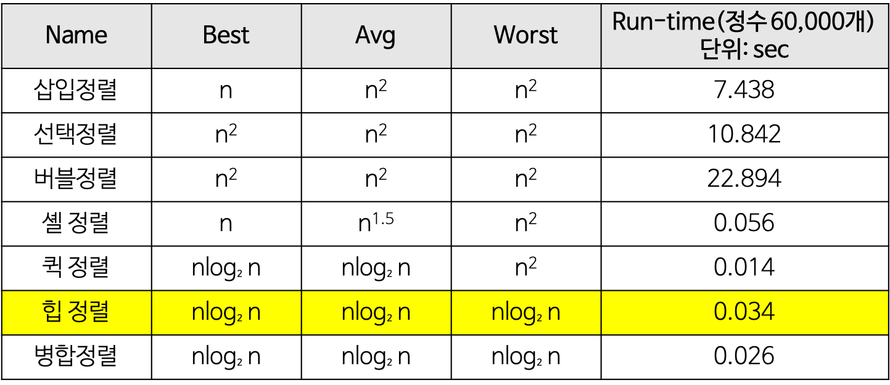

# 23. 우선순위 큐와 힙

### 우선순위 큐

큐는 선입선출(FIFO) 자료구조

우선순위 큐는 우선순위가 가장 높은 자료가 가장 먼저 꺼내진다!

원소를 꺼낼 때 일일히 순회하며 우선순위가 높은 원소를 찾는다면 O(n)의 시간이 걸릴 것이다.

원소들을 우선순위에 따라 **미리 정렬**해두자!

이진 검색 트리보다 훨씬 단순한 **힙(heap)** 을 사용한다. 원소의 추가와 꺼내는 것을 모두 **O(lgN)** 시간에 할 수 있다.


힙의 모양 규칙

- 마지막 레벨을 제외한 모든 레벨에 노드가 꽉 차있어야 한다
- 마지막 레벨에 노드가 있을 때는 항상 가장 왼쪽부터 순서대로 채워져 있어야 한다.


-> 위 레벨에서부터 순서대로 쌓은 배열을 이용해 나타낼 수 있다!


A[i] 의 왼쪽 자손: A[2 * i + 1]

A[i] 의 오른쪽 자손: A[2 * i + 2]

A[i] 의 부모: A[(i-1)/2]		(소수점 아래 내림)

```c++
vector<int> heap
```


### 23.1 힙에 새 원소 삽입하기

```c++
// 23.1 정수 원소를 갖는 최대 힙에 새 원소 삽입하기

// 정수를 담는 최대 힙 heap 에 새 원소 newValue 를 삽입한다.
void push_heap(vector<int>& heap, int newValue) {
    // 힙의 맨 끝에 newValue 를 삽입한다.
    heap.push_back(newValue)
    // 현재 newValue 의 위치
    int idx = heap.size() - 1;
    // 루트에 도달하거나 newValue  이상의 원소를 가진 조상을 만날 때까지
    while(idx > 0 && heap[(idx - 1) / 2] < heap[idx]) {
        swap(heap[idx], heap[(idx - 1) / 2]);
        idx = (idx - 1) / 2;
    }
}
```

### 23.2 최대 원소 꺼내기

```c++
// 23.2  정수 원소를 갖는 최대 힙에서 최대 원소 삭제하기

// 정수를 담는 최대 힙 heap 에서 heap[0] 을 제거한다.
void pop_heap(vector<int>& heap) {
    // 힙의 맨 끝에서 값을 가져와 루트에 덮어씌운다.
    heap[0] = heap.back();
    heap.pop_back();
    int here = 0;
    while(true) {
        int left = here * 2 + 1, right = here * 2 + 2;
        // 리프에 도달한 경우
        if(left >= heap.size()) break;
        // heap[there] 가 내려갈 위치를 찾는다.
        int next = here;
        if(heap[next] < heap[left])
            next = left;
        if(right < heap.size() && heap[next] < heap[right])
            next = right;
        if(next == here) break;
        swap(heap[here], heap[next]);
        here = next;
    }
}
```


### 힙 정렬





### 23.4 변화하는 중간값

{3, 1, 3, 4, 5, 3, 2, 1, 2,3}

```c++
// 23.3 변화하는 중간 값 문제를 트립을 사용해 풀기

// rng 가 생성하는 첫 n개의 난수를 수열에 추가하며 중간값을 구한다.
int runningMedian(int n, RNG rng) {
    Node* root = NULL;
    int ret = 0;
    for(int cnt = 1; cnt <= n; ++cnt) {
        root = insert(root, new Node(rng.next()));
        int median = kth(root, (cnt + 1) / 2)->key;
        ret = (ret + median) % 20090711;
    }
    return ret;
}
```

```c++
// 23.4 힙을 이용해 변화하는 중간값 문제를 해결하는 함수의 구현

int runningMedian(int n, RNG rng) {
    priority_queue<int, vector<int>, less<int>, > maxHeap;
    priority_queue<int, vector<int>, greater<int> > maxHeap;
    int ret = 0;
    // 반복문 불변식:
    // 1. maxHeap 의 크기는 minHeap의 크기와 같거나 1 더 크다
    // 2. maxHeap.top() <= minHeap.top()
    for(int cnt = 1; cnt <= n; ++cnt) {
        // 우선 1번 불변식부터 만족시킨다. 
        if(maxHeap.size() == minHeap.size())
            maxHeap.push(rng.next());
        else
            minHeap.push(rng.next());
        // 2번 불변식이 깨졌을 경우 복구하자.
        if(!minHeap.empty() && !maxHeap.top() && minHeap.top() < maxHeap.top()) {
            int a = maxHeap.top(), b = minHeap.top();
            maxHeap.pop(); minHeap.pop();
            maxHeap.push(b);
            minHeap.push(a);
        }
        ret = (ret + maxHeap.top()) % 20090711;
    }
    return ret;
}
```

```c++
// 23.5 변화하는 중간값 문제의 입력 생성하기
struct RNG {
    int seed, a, b;
    RNG(int _a, int _b) : a(_a), b(_b), seed(1983) {}
    int next() {
        int ret = seed;
        // 정수 오버플로 방지하기 위해 long long(64비트 정수) 사용
        seed = ((seed * (long long)a + b)) % 20090711;
        return ret;
    }
};
```

